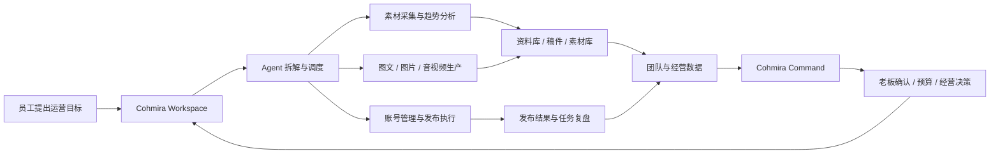

<div align="center">
  

  <h3>面向电商与自媒体团队的本地多 Agent 运营平台</h3>

  <p>
    让员工端负责采集、创作与发布，让老板端负责进度、经营与决策。
  </p>

  <p>
    
    
    
    
    
  </p>

  <p>
    <a href="#-功能展示">功能展示</a> ·
    <a href="#-核心能力">核心能力</a> ·
    <a href="#-快速开始">快速开始</a> ·
    <a href="#-自动检查与发布">自动发布</a> ·
    <a href="#-开源项目鸣谢">开源鸣谢</a>
  </p>

  <p><strong>简体中文</strong> · <a href="./README_EN.md">English</a></p>
</div>

> [!IMPORTANT]
> 商媒运营助手目前处于 Alpha 阶段。员工端与老板端均已具备 Tauri 桌面壳；老板端业务后端由本地 Rust `boss-server`、SQLite 与 Tauri IPC 提供，并支持 macOS / Windows 构建。涉及真实账号发布、财务写入和生产安装包时，请在目标机器上重新验收。

## 为什么做商媒运营助手

电商与自媒体团队通常需要在搜索、素材、选题、内容、账号、发布、复盘和经营数据之间反复切换。通用聊天机器人只能给建议，很难持续管理任务状态、工具运行和最终产物。

商媒运营助手把这些工作组合成一套本地 Agent 平台：

- 员工在 **Cohmira Workspace** 中提出目标，Agent 拆解任务并调用采集、创作、媒体和社媒工具执行。
- 任务产物进入资料库、稿件、素材库、任务队列和团队成果，不只停留在聊天记录中。
- 老板在 **Cohmira Command** 中查看员工进度、阻塞、质量、成本、账本和发票，并通过老板 AI 查询经营上下文。
- Cookie、API Key、账号文件和经营数据默认保留在本地，真实发布前保留人工确认闸门。

## 🖼 功能展示

### Cohmira Workspace · 员工工作台

从运营目标出发，统一管理 Agent 任务、趋势采集、选题分析、内容生产、素材沉淀、账号发布和任务复盘。

<p align="center">
  
</p>

### Cohmira Command · 老板指挥台

围绕经营决策汇总员工进展、任务风险、内容投入、财务记账、发票草稿和需要老板确认的事项。

<p align="center">
  
</p>

> 上图为根据当前产品模块制作的界面示意，实际界面和数据以当前构建版本为准。

## ✨ 核心能力

| 能力 | 当前实现 |
| --- | --- |
| 多 Agent 任务执行 | 将运营目标拆分为可跟踪任务，展示工具调用、执行时间线、状态和产物 |
| 素材与趋势采集 | 管理公开内容采集、浏览器扩展、素材导入、账号登录态和结构化数据 |
| 内容生产 | 支持选题、图文稿件、封面、图片、音频、视频草稿和媒体资产管理 |
| 社媒账号与发布 | 管理多平台账号，支持发布计划、`dry_run`、人工确认和结果回流 |
| 知识与长期档案 | 按工作空间保存资料、创作档案、用户偏好、技能与长期记忆 |
| 团队工作台 | 汇总任务队列、员工成果、阻塞、质量、成本和后续计划 |
| 老板经营视图 | 查询员工周报、经营摘要、账本、发票草稿和 Actual Budget 同步状态 |
| 本地工具生态 | 通过 Rust 服务、MCP、内置插件、CLI Runtime 和浏览器扩展连接外部能力 |

## 🧩 产品组成

| 模块 | 目录 | 定位 | 当前形态 |
| --- | --- | --- | --- |
| Cohmira Workspace | [`src/`](./src/) | 员工执行端 | React + Tauri + Rust，支持 macOS / Windows 打包 |
| Cohmira Command | [`boss/`](./boss/) | 老板管理端 | TypeScript + Vite + Tauri + Rust/SQLite，支持 macOS / Windows 打包 |
| Browser Extension | [`src/Plugin/`](./src/Plugin/) | 浏览器采集与控制 | Chrome / Edge Manifest V3 扩展 |
| Built-in Plugins | [`src/builtin-plugins/`](./src/builtin-plugins/) | 视频、媒体和扩展工具 | 由应用内置 `uv` 与插件运行时管理 |

## 🔄 业务闭环



## 🏗 技术架构

```text
React / Vite Renderer
        │
        ▼
Tauri IPC ───────────── Browser Extension
        │                       │
        ▼                       ▼
yunying-server ◄──────── Browser Control MCP
        │
        ├── Goose Agent Runtime
        ├── MediaCrawler-compatible collection
        ├── Social publishing adapters
        ├── Knowledge / Task / Media repositories
        └── Built-in plugins + uv + CLI Runtime

Boss Vite UI ── Tauri IPC / Rust boss-server ── SQLite / Actual Budget
```

主要技术栈：

- 桌面端：Tauri 2、Rust、Tokio、SQLite。
- 前端：React 18、TypeScript、Vite、Radix UI、Lucide。
- Agent：Goose、Model Context Protocol、内置工具与插件系统。
- 媒体：Remotion、MediaBunny、OpenMontage 和时间线编辑组件。
- 老板端：TypeScript、Vite、Tauri、本地 Rust `boss-server`、SQLite 与 Actual Budget 可选集成。

## 🚀 快速开始

### 环境要求

- Node.js 22。
- Rust 1.91.1 与 Cargo。
- npm；构建浏览器扩展时还需要 pnpm 10。
- macOS 需要 Xcode Command Line Tools。
- Windows 需要 Visual Studio Build Tools 2022 和 WebView2 Runtime。

### 启动员工工作台

首次准备：

```bash
npm install --global @tauri-apps/cli@2.11.4

cd src
test -f config.json || cp config.json.example config.json

cd desktop
npm ci
npm run dev
```

保持 Vite 运行，在另一个终端启动 Tauri：

```bash
cd src
tauri dev
```

完整配置、账号登录和打包说明见 [`src/README.md`](./src/README.md)。

### 启动老板指挥台

```bash
cd boss/desktop
npm ci
npm run tauri:dev
```

该命令会启动 Vite 渲染层和 Tauri 桌面窗口，本地 Rust 后端同时提供 Tauri IPC 与员工同步所需的 HTTP 服务。只调试 Web 渲染层时可使用 `npm run dev`。账本和 Actual Budget 配置见 [`boss/README.md`](./boss/README.md)。

### 构建浏览器扩展

```bash
cd src/Plugin
corepack enable
pnpm install --frozen-lockfile
pnpm build
```

构建产物位于 `src/Plugin/dist/extension/`，可通过 Chrome 或 Edge 的“加载已解压的扩展程序”导入。

## ✅ 常用检查

```bash
# 员工端前端
npm ci --prefix src/desktop
npm run build --prefix src/desktop

# 老板端前端
npm ci --prefix boss/desktop
npm run build --prefix boss/desktop

# 老板端 Rust 后端
cargo test --manifest-path boss/desktop/src-tauri/Cargo.toml --locked --all-targets

# 浏览器扩展
pnpm --dir src/Plugin install --frozen-lockfile
pnpm --dir src/Plugin build
pnpm --dir src/Plugin typecheck

# Rust 核心
cargo check --manifest-path src/Cargo.toml --locked \
  -p yunying-ops -p yunying-server \
  --features yunying-ops/mcp
```

## 📦 自动检查与发布

- [`.github/workflows/check.yml`](./.github/workflows/check.yml) 在普通分支 push、Pull Request 和手动触发时检查品牌资源、三端前端和 Rust 核心。
- [`.github/workflows/release.yml`](./.github/workflows/release.yml) 在推送与员工端版本一致的 `v*` 标签时构建并发布，也支持在 Actions 页面手动触发。
- 当前父仓 Release 只发布员工端 macOS DMG、Windows x64 NSIS 安装器和 SHA-256 校验文件；老板端与浏览器扩展后续独立发布。
- 员工端三个版本文件必须一致，Release 标签格式为 `v<版本>`。

```bash
git tag v0.1.0
git push origin v0.1.0
```

首个自动包以 prerelease 发布。macOS 使用 ad-hoc 签名、尚未接入 Apple 公证，并且只内置 `uv`，完整离线 FFmpeg/Python 运行时仍待补齐；Windows 安装器包含固定版本的 FFmpeg 与 Python 插件离线运行时，但尚未接入 Authenticode 签名。

## 🗂 仓库结构

```text
yunyingagent/
├── .github/workflows/       # 自动检查与跨平台发布
├── branding/cohmira/        # 品牌 Logo 与规范
├── docs/images/             # README 产品展示图
├── src/
│   ├── desktop/             # 员工端 React 前端
│   ├── src-tauri/           # Tauri 桌面壳与安装包配置
│   ├── crates/              # Agent、采集、发布和本地服务
│   ├── Plugin/              # 浏览器扩展
│   └── builtin-plugins/     # 随应用分发的插件
└── boss/
    ├── desktop/             # 老板端 Vite UI、Tauri 壳与 Rust 后端
    ├── mcps/                # 旧 MCP 数据迁移说明（非运行时后端）
    └── third_party/actual/  # Actual Budget 集成源码
```

## 🔐 安全与合规

- API Key、Cookie、Actual 凭据和真实账号文件不得提交到版本库。
- 只采集已获授权或可合理使用的公开数据，并遵守目标平台规则。
- 真实发布默认关闭；账号校验、参数检查与用户确认通过后才执行写操作。
- 老板端经营和财务回答必须来自工具返回，缺失数据应标记为未知或待复核。
- 安装包、浏览器自动化和真实账号流程必须在目标 macOS / Windows 机器上重新验收。

## 🛣 Roadmap

- [x] 员工端 React + Tauri + Rust 基础架构。
- [x] 任务、资料、稿件、素材和社媒账号主要页面。
- [x] 浏览器采集扩展与本地 MCP 控制链路。
- [x] macOS DMG 与 Windows NSIS 自动打包工作流。
- [x] 老板端经营、账本、发票与员工周报能力。
- [x] 老板端独立 Tauri 桌面包与 macOS / Windows 构建矩阵。
- [ ] Windows 完整 FFmpeg 与 Python 插件离线运行时。
- [ ] 员工端与老板端正式组织、权限和数据同步协议。
- [ ] Apple Developer ID 签名、公证与 Windows 代码签名。
- [ ] 清零员工端严格 TypeScript 类型错误并扩大自动化测试覆盖。

## 🙏 开源项目鸣谢

商媒运营助手建立在大量优秀开源项目之上。感谢这些项目及其贡献者：

| 项目 | 在本项目中的用途 |
| --- | --- |
| [Goose](https://github.com/block/goose) | Agent 运行时与工具编排基础 |
| [Model Context Protocol Rust SDK](https://github.com/modelcontextprotocol/rust-sdk) | MCP Server、Client 与工具协议实现 |
| [Remotion](https://github.com/remotion-dev/remotion) | React 视频预览、场景与合成能力 |
| [MediaBunny](https://github.com/Vanilagy/mediabunny) | 浏览器端媒体读取、处理与导出能力 |
| [Radix UI](https://github.com/radix-ui/primitives) | 可访问的前端交互组件基础 |
| [Lucide](https://github.com/lucide-icons/lucide) | 员工端与老板端图标体系 |
| [CodeMirror](https://github.com/codemirror/dev) | Markdown、提示词和结构化文本编辑 |
| [Actual Budget](https://github.com/actualbudget/actual) | 老板端可选的本地财务系统集成 |
| [OpenMontage](https://github.com/calesthio/OpenMontage) | 内置 AI 视频与短剧生产工作流 |
| [MediaCrawler](https://github.com/NanmiCoder/MediaCrawler) | 多平台公开内容采集能力的重要参考 |
| [social-auto-upload](https://github.com/dreammis/social-auto-upload) | 多平台内容发布与账号自动化能力的重要参考 |

本仓库还使用了许多 Rust crate、npm 包和内嵌工具。各第三方项目的版权与许可证归原作者所有；分发修改版本时请保留其许可证与署名要求。

## 🤝 参与贡献

欢迎通过 Issue 或 Pull Request 提交问题、适配器、工具、文档和界面改进。提交前建议：

1. 不提交真实密钥、Cookie、账号文件、账本或用户数据。
2. 只修改任务范围内的代码，避免覆盖工作区中其他未提交改动。
3. 至少运行与修改范围对应的前端构建、类型检查或 Rust 检查。
4. UI 变更附带截图；真实账号和发布链路说明测试平台与安全边界。

## 📄 License

当前仓库根目录尚未声明统一开源许可证，因此不应默认视为允许商业使用。第三方代码和内嵌项目继续遵循各自许可证；正式公开发布前需要补充根级许可证、第三方 NOTICE 和完整的软件物料清单。
