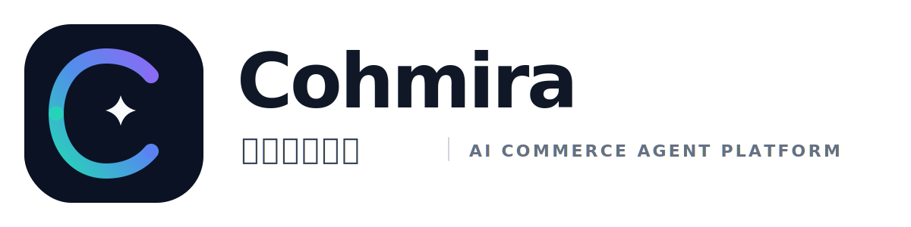
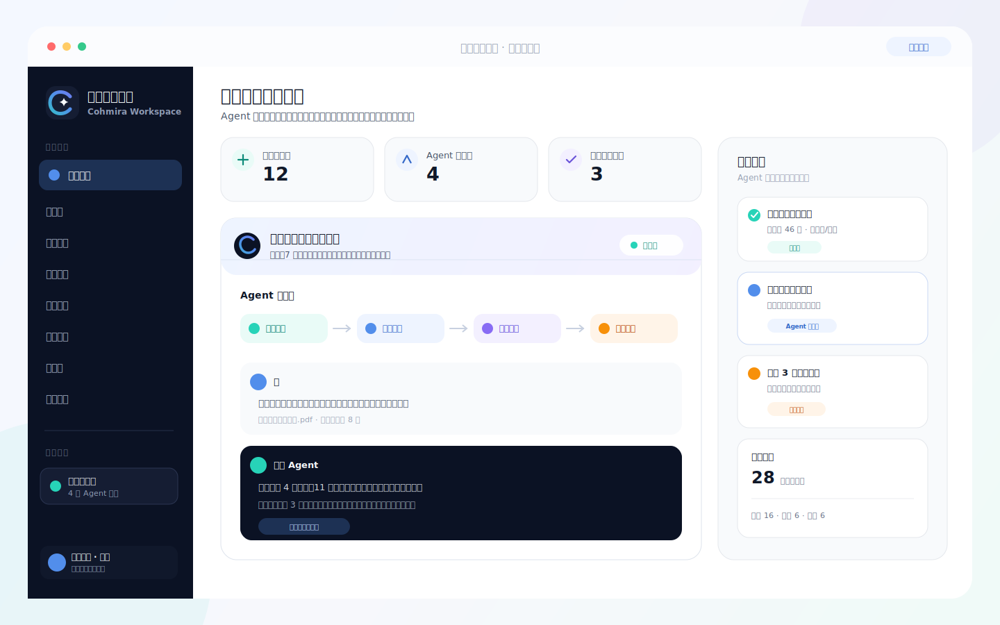
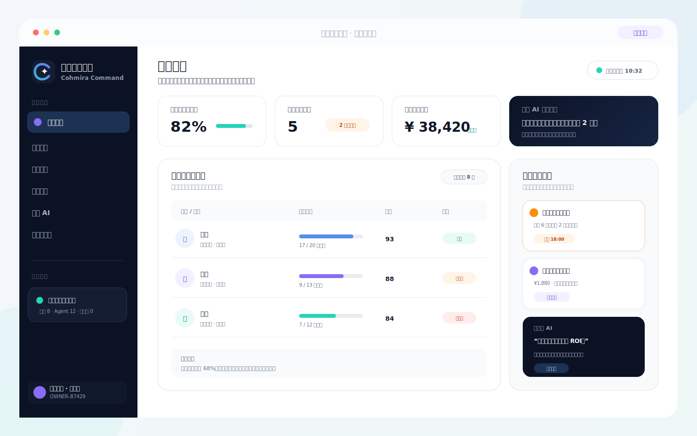
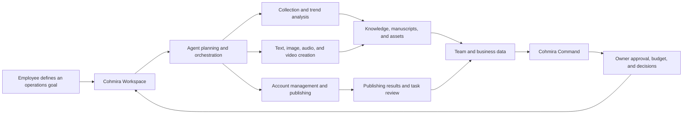

<div align="center">
  

  <h3>A local multi-agent operations platform for e-commerce and social media teams</h3>

  <p>
    Cohmira Workspace helps employees collect, create, and publish. Cohmira Command helps owners supervise, review, and decide.
  </p>

  <p>
    
    
    
    
    
  </p>

  <p>
    <a href="#product-showcase">Showcase</a> ·
    <a href="#core-capabilities">Capabilities</a> ·
    <a href="#quick-start">Quick Start</a> ·
    <a href="#automated-checks-and-releases">Releases</a> ·
    <a href="#open-source-acknowledgements">Acknowledgements</a>
  </p>

  <p><a href="./README.md">简体中文</a> · <strong>English</strong></p>
</div>

> [!IMPORTANT]
> Cohmira is currently in Alpha. Both clients now include Tauri desktop shells. The boss client uses a local Rust `boss-server`, SQLite, and Tauri IPC and supports macOS and Windows builds. Revalidate real-account publishing, financial writes, and production installers on the target machine.

## Why Cohmira

E-commerce and social media teams constantly move between search, materials, topics, content, accounts, publishing, analytics, and business data. A general-purpose chatbot can suggest what to do, but it rarely owns task state, tool execution, and durable outputs.

Cohmira brings those activities into one local Agent platform:

- Employees use **Cohmira Workspace** to describe a goal while Agents break it down and run collection, creation, media, and publishing tools.
- Outputs are stored as knowledge, manuscripts, assets, tasks, and team results instead of remaining only in chat history.
- Owners use **Cohmira Command** to review progress, blockers, quality, cost, accounting, and invoice drafts, with an AI interface over verified business context.
- Cookies, API keys, account files, and operating data stay local by default, with a human confirmation gate before real publishing.

## Product Showcase

### Cohmira Workspace · Employee Client

Manage Agent tasks, trend collection, topic analysis, content production, media assets, social accounts, publishing, and reviews from one operations workspace.

<p align="center">
  
</p>

### Cohmira Command · Boss Client

Bring employee progress, task risks, content investment, accounting, invoice drafts, and owner approvals into a focused management view.

<p align="center">
  
</p>

> These images are interface illustrations based on the current product modules. The active build remains the source of truth for UI details and data.

## Core Capabilities

| Capability | Current implementation |
| --- | --- |
| Multi-agent task execution | Break goals into trackable tasks and expose tool calls, timelines, states, and outputs |
| Collection and trend research | Manage public-data collection, browser-extension capture, imports, account sessions, and structured records |
| Content production | Create topics, articles, covers, images, audio, video drafts, and reusable media assets |
| Social accounts and publishing | Manage multiple platforms with schedules, `dry_run`, human approval, and result feedback |
| Knowledge and long-term records | Persist workspace knowledge, creative archives, preferences, skills, and long-term memory |
| Team operations | Summarize queues, employee output, blockers, quality, cost, and next actions |
| Owner operations view | Query employee reports, business summaries, accounting, invoice drafts, and Actual Budget sync state |
| Local tool ecosystem | Connect Rust services, MCP, built-in plugins, CLI runtimes, and the browser extension |

## Product Modules

| Module | Directory | Purpose | Current form |
| --- | --- | --- | --- |
| Cohmira Workspace | [`src/`](./src/) | Employee execution client | React + Tauri + Rust; macOS and Windows packaging |
| Cohmira Command | [`boss/`](./boss/) | Owner management client | TypeScript + Vite + Tauri + Rust/SQLite; macOS and Windows packaging |
| Browser Extension | [`src/Plugin/`](./src/Plugin/) | Browser collection and control | Chrome / Edge Manifest V3 extension |
| Built-in Plugins | [`src/builtin-plugins/`](./src/builtin-plugins/) | Video, media, and integration tools | Managed by the bundled `uv` and plugin runtime |

## Business Loop



## Architecture

```text
React / Vite Renderer
        │
        ▼
Tauri IPC ───────────── Browser Extension
        │                       │
        ▼                       ▼
yunying-server ◄──────── Browser Control MCP
        │
        ├── Goose Agent Runtime
        ├── MediaCrawler-compatible collection
        ├── Social publishing adapters
        ├── Knowledge / Task / Media repositories
        └── Built-in plugins + uv + CLI Runtime

Boss Vite UI ── Tauri IPC / Rust boss-server ── SQLite / Actual Budget
```

Main technologies:

- Desktop: Tauri 2, Rust, Tokio, and SQLite.
- Frontend: React 18, TypeScript, Vite, Radix UI, and Lucide.
- Agent runtime: Goose, Model Context Protocol, built-in tools, and plugins.
- Media: Remotion, MediaBunny, OpenMontage, and timeline editing components.
- Boss client: TypeScript, Vite, Tauri, a local Rust `boss-server`, SQLite, and optional Actual Budget integration.

## Quick Start

### Requirements

- Node.js 22.
- Rust 1.91.1 and Cargo.
- npm; pnpm 10 is also required for the browser extension.
- Xcode Command Line Tools on macOS.
- Visual Studio Build Tools 2022 and WebView2 Runtime on Windows.

### Start Cohmira Workspace

Initial setup:

```bash
npm install --global @tauri-apps/cli@2.11.4

cd src
test -f config.json || cp config.json.example config.json

cd desktop
npm ci
npm run dev
```

Keep Vite running, then start Tauri in another terminal:

```bash
cd src
tauri dev
```

See [`src/README_EN.md`](./src/README_EN.md) for configuration, account login, and packaging details.

### Start Cohmira Command

```bash
cd boss/desktop
npm ci
npm run tauri:dev
```

This starts the Vite renderer and Tauri window; the local Rust backend provides both Tauri IPC and the HTTP service used for employee synchronization. Use `npm run dev` only when debugging the web renderer. See [`boss/readme_en.md`](./boss/readme_en.md) for accounting and Actual Budget setup.

### Build the Browser Extension

```bash
cd src/Plugin
corepack enable
pnpm install --frozen-lockfile
pnpm build
```

Load `src/Plugin/dist/extension/` as an unpacked extension in Chrome or Edge.

## Common Checks

```bash
# Employee frontend
npm ci --prefix src/desktop
npm run build --prefix src/desktop

# Boss frontend
npm ci --prefix boss/desktop
npm run build --prefix boss/desktop

# Boss Rust backend
cargo test --manifest-path boss/desktop/src-tauri/Cargo.toml --locked --all-targets

# Browser extension
pnpm --dir src/Plugin install --frozen-lockfile
pnpm --dir src/Plugin build
pnpm --dir src/Plugin typecheck

# Rust core
cargo check --manifest-path src/Cargo.toml --locked \
  -p yunying-ops -p yunying-server \
  --features yunying-ops/mcp
```

## Automated Checks and Releases

- [`.github/workflows/check.yml`](./.github/workflows/check.yml) checks brand assets, all three frontends, and the Rust core on normal pushes, pull requests, and manual runs.
- [`.github/workflows/release.yml`](./.github/workflows/release.yml) builds and publishes when a `v*` tag matching the employee version is pushed, and it also supports manual dispatch from the Actions page.
- The parent release currently publishes only the employee macOS DMG, Windows x64 NSIS installer, and SHA-256 checksums. The boss client and browser extension will be released separately later.
- All three employee version files must agree, and release tags use `v<version>`.

```bash
git tag v0.1.0
git push origin v0.1.0
```

The first automated package is published as a prerelease. macOS uses ad-hoc signing, is not notarized, and bundles `uv` without the complete offline FFmpeg/Python runtimes. The Windows installer includes pinned FFmpeg and Python plugin offline runtimes but is not Authenticode-signed yet.

## Repository Layout

```text
yunyingagent/
├── .github/workflows/       # Automated checks and cross-platform releases
├── branding/cohmira/        # Brand logo and guidelines
├── docs/images/             # README product illustrations
├── src/
│   ├── desktop/             # Employee React frontend
│   ├── src-tauri/           # Tauri desktop shell and packaging
│   ├── crates/              # Agent, collection, publishing, and local services
│   ├── Plugin/              # Browser extension
│   └── builtin-plugins/     # Plugins distributed with the application
└── boss/
    ├── desktop/             # Boss Vite UI, Tauri shell, and Rust backend
    ├── mcps/                # Legacy MCP migration notes (not the runtime backend)
    └── third_party/actual/  # Actual Budget integration source
```

## Security and Compliance

- Never commit API keys, cookies, Actual credentials, account files, ledgers, or user data.
- Collect only authorized or reasonably usable public data and comply with each platform's rules.
- Real publishing stays disabled until account validation, parameter checks, and explicit user confirmation pass.
- Business and finance answers must come from tool results; missing data should remain unknown or pending review.
- Revalidate installers, browser automation, and real-account workflows on the target macOS or Windows machine.

## Roadmap

- [x] React + Tauri + Rust foundation for the employee client.
- [x] Main task, knowledge, manuscript, media, and social-account screens.
- [x] Browser collection extension and local MCP control path.
- [x] Automated macOS DMG and Windows NSIS packaging workflow.
- [x] Boss-client operations, accounting, invoice, and employee-report workflows.
- [x] Standalone Tauri boss desktop package and macOS / Windows build matrix.
- [ ] Complete offline FFmpeg and Python plugin runtimes on Windows.
- [ ] Production organization, permissions, and synchronization protocol between both clients.
- [ ] Apple Developer ID signing, notarization, and Windows code signing.
- [ ] Resolve strict employee-client TypeScript errors and expand automated test coverage.

## Open Source Acknowledgements

Cohmira is built on the work of many open-source communities. We thank these projects and their contributors:

| Project | How Cohmira uses it |
| --- | --- |
| [Tauri](https://github.com/tauri-apps/tauri) | macOS / Windows desktop shell, IPC, and installer builds |
| [React](https://github.com/facebook/react) | Employee-client UI and media workspace |
| [Vite](https://github.com/vitejs/vite) | Frontend builds for the employee client, boss client, and related extension tooling |
| [Goose](https://github.com/block/goose) | Agent runtime and tool orchestration foundation |
| [Model Context Protocol Rust SDK](https://github.com/modelcontextprotocol/rust-sdk) | MCP servers, clients, and tool protocol implementation |
| [Remotion](https://github.com/remotion-dev/remotion) | React-based video previews, scenes, and composition |
| [MediaBunny](https://github.com/Vanilagy/mediabunny) | Browser-side media reading, processing, and export |
| [Radix UI](https://github.com/radix-ui/primitives) | Accessible interaction primitives |
| [Lucide](https://github.com/lucide-icons/lucide) | Icon system across both clients |
| [CodeMirror](https://github.com/codemirror/dev) | Markdown, prompt, and structured-text editing |
| [Actual Budget](https://github.com/actualbudget/actual) | Optional local finance integration for the boss client |
| [OpenMontage](https://github.com/calesthio/OpenMontage) | Built-in AI video and short-drama workflows |
| [MediaCrawler](https://github.com/NanmiCoder/MediaCrawler) | Important reference for multi-platform public-content collection |
| [social-auto-upload](https://github.com/dreammis/social-auto-upload) | Important reference for multi-platform publishing and account automation |

The repository also uses many Rust crates, npm packages, and embedded tools. Copyright and licenses remain with their respective authors; preserve all required license and attribution notices when redistributing modified builds.

## Contributing

Issues and pull requests for adapters, tools, documentation, and UI improvements are welcome. Before submitting:

1. Do not include real credentials, cookies, accounts, ledgers, or user data.
2. Keep changes scoped and do not overwrite unrelated worktree changes.
3. Run the frontend build, type check, or Rust check relevant to your changes.
4. Include screenshots for UI changes and document the platform and safety boundary for real-account tests.

## License

The repository root does not currently declare a unified open-source license, so commercial-use permission must not be assumed. Third-party and embedded code remain under their own licenses. Add a root license, third-party NOTICE, and complete software bill of materials before a public release.
